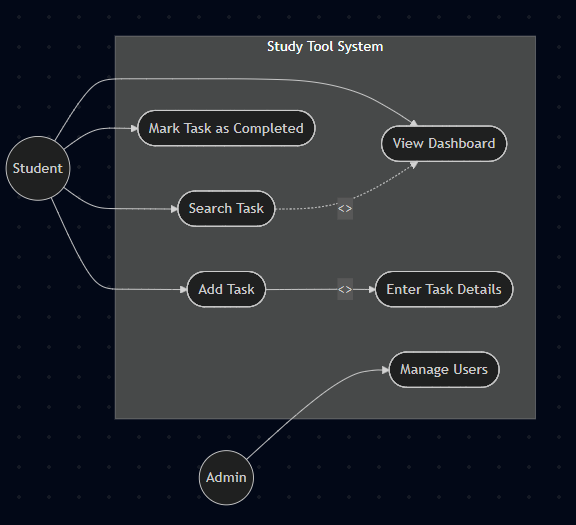
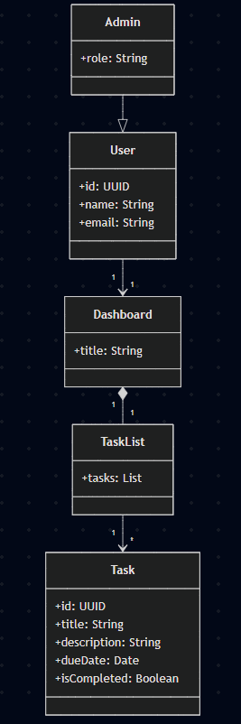

#Use Case Diagram#

## Actors

- Student – Primary user who manages personal study tasks.
- Admin – Secondary user responsible for administrative actions such as managing users.

## Use Cases

### Student
- View Dashboard – Displays all tasks.
- Add Task – Allows the student to create a new task.
- Mark Task as Completed – Marks a task as finished.
- Search Task – Filters tasks based on search input.

### Admin
- Manage Users – Allows administrative control over user accounts.

## Relationships

- "Add Task" includes "Enter Task Details"  
  The system requires task details (e.g., title, due date) whenever a task is created.

- "Search Task" extends "View Dashboard"  
  Searching is an optional extension of viewing the dashboard.

## Edge Case

If a student attempts to mark a task as completed that no longer exists, the system should display an error message and prevent the action.

#Class Diagram#

## Modeling Decision

- Composition (Dashboard → TaskList)
  - A TaskList cannot exist without a Dashboard.
  - If Dashboard is deleted, TaskList is deleted as well.
